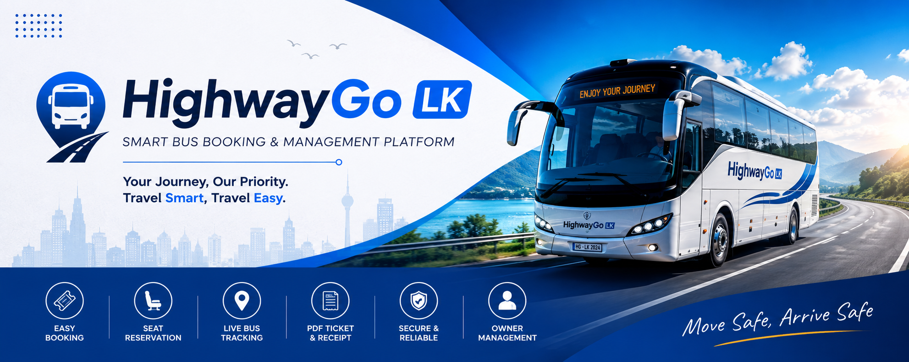

# 🚍 HighwayGo LK – Smart Bus Booking & Management Platform

<p align="center">
  
</p>

<p align="center">
  
  
  
  
  
</p>

---

## 📖 Overview

**HighwayGo LK** is a full-stack mobile bus booking and management application developed using **React Native, Node.js, Express.js, and MongoDB**.

The application allows passengers to search buses, reserve seats, generate digital tickets, download PDF receipts, and track buses in real time. Bus owners can manage buses, routes, schedules, bookings, and live bus locations through a dedicated owner module.

This project was developed as a real-world transportation management solution to improve the bus booking experience in Sri Lanka.

---

## 🏆 Project Highlights

- Full Stack Mobile Application
- Passenger and Bus Owner Modules
- JWT Authentication
- Bus Route Search
- Interactive Seat Selection
- Digital Ticket Generation
- PDF Receipt Download
- Live Bus Tracking
- MongoDB Atlas Cloud Database
- Backend Deployed on Render
- Android APK Built with Expo EAS

---

## ✨ Key Features

### 👤 Passenger Features

- User Registration and Login
- Secure JWT Authentication
- Search Bus Routes
- Select Departure and Destination
- Select Journey Date
- Select Passenger Count
- Interactive Seat Reservation
- Booking Confirmation
- PDF Receipt Download
- Live Bus Tracking
- Persistent Login

### 🚌 Bus Owner Features

- Owner Registration and Login
- Add New Buses
- Manage Bus Fleet
- Add and Manage Routes
- Automatic Return Route Creation
- View Passenger Bookings
- Update Live Bus Location
- Dashboard Overview

---

## 📸 Application Screenshots

### 📱 Passenger Experience

<p align="center">
  
  
  
</p>

<p align="center">
  
  
  
</p>

> Replace `LOGIN_URL`, `HOME_URL`, `BUS_SEARCH_URL`, `SEAT_SELECTION_URL`, `BOOKING_CONFIRMED_URL`, and `LIVE_TRACKING_URL` with your GitHub uploaded image links.

---

## 🏗 System Architecture

```text
React Native Mobile App
          │
          ▼
REST API Backend
(Node.js + Express.js)
          │
          ▼
MongoDB Atlas Database
          │
          ▼
Render Cloud Deployment
```

---

## 🛠 Technology Stack

### Frontend

- React Native
- Expo
- Expo Router
- Axios
- AsyncStorage
- React Native Maps
- Expo Image Picker

### Backend

- Node.js
- Express.js
- MongoDB
- Mongoose
- JWT Authentication
- Nodemailer
- PDFKit

### Deployment

- Render
- MongoDB Atlas
- Expo EAS Build

---

## 🔐 Authentication & Security

HighwayGo LK uses **JWT Authentication** to protect user and owner accounts.

Security features include:

- Secure Login and Registration
- Protected API Routes
- Authorization Middleware
- Persistent User Sessions
- Role-Based Access for Passengers and Owners

---

## 🚀 Core Functionalities

### 🔍 Bus Search

Passengers can search buses by selecting departure location, destination, travel date, and passenger count.

### 💺 Seat Reservation

The app provides an interactive seat selection system with available, selected, and booked seat states.

### 🎫 Booking System

Passengers can confirm bookings and view booking details including route, date, seat number, and total amount.

### 📄 PDF Receipt Generation

After booking, the system generates a downloadable PDF receipt with booking and passenger details.

### 📍 Live Bus Tracking

Passengers can track buses using map-based live tracking with route and bus location details.

### 🚌 Bus Owner Management

Bus owners can add buses, manage routes, view bookings, and update live bus locations.

---

## 📂 Project Structure

```bash
highwaygo-lk-app
│
├── backend
│   ├── controllers
│   ├── middleware
│   ├── models
│   ├── routes
│   ├── receipts
│   ├── utils
│   ├── package.json
│   └── server.js
│
├── mobile
│   ├── app
│   ├── assets
│   ├── components
│   ├── constants
│   ├── hooks
│   ├── services
│   ├── package.json
│   └── app.json
│
└── README.md
```

---

## ⚙️ Installation

### Backend Setup

```bash
cd backend
npm install
npm start
```

### Mobile App Setup

```bash
cd mobile
npm install
npx expo start
```

---

## 🔑 Environment Variables

Create a `.env` file inside the `backend` folder.

```env
MONGO_URI=your_mongodb_connection_string
JWT_SECRET=your_jwt_secret_key
EMAIL=your_email@gmail.com
EMAIL_PASS=your_gmail_app_password
```

---

## 🌐 Live Backend API

```text
https://highwaygo-lk-app.onrender.com
```

---

## 📱 APK Build

The Android APK was built using **Expo EAS Build**.

```bash
eas build --platform android --profile preview
```

---

## 📈 Future Enhancements

- Online Payment Gateway Integration
- Push Notifications
- Admin Dashboard
- Ratings and Reviews
- Revenue Analytics
- Driver Management System
- Advanced GPS Tracking

---

## 🎯 Learning Outcomes

Through this project, I gained practical experience in:

- Full Stack Development
- Mobile App Development
- REST API Development
- MongoDB Database Design
- JWT Authentication
- Cloud Deployment
- APK Build Process
- Real-World Software Engineering Practices

---

## 👨‍💻 Developer

### Ramindu Sulakkana

**Undergraduate | SLIIT**

Interested in:

- Software Engineering
- Mobile App Development
- Full Stack Development
- Data Science
- Machine Learning

📧 **Email:** ramindusulakkanamadushan@gmail.com

🌐 **Portfolio:** https://ramindusulakkana.netlify.app

💼 **LinkedIn:** https://www.linkedin.com/in/ramindu-sulakkana

---

## ⭐ Project Summary

**HighwayGo LK** is a complete mobile bus booking and management platform that combines authentication, route search, seat booking, PDF receipt generation, owner management, and live bus tracking into one scalable mobile application.

This project demonstrates practical knowledge of **React Native, Node.js, Express.js, MongoDB, REST API development, cloud deployment, and mobile application development**.


